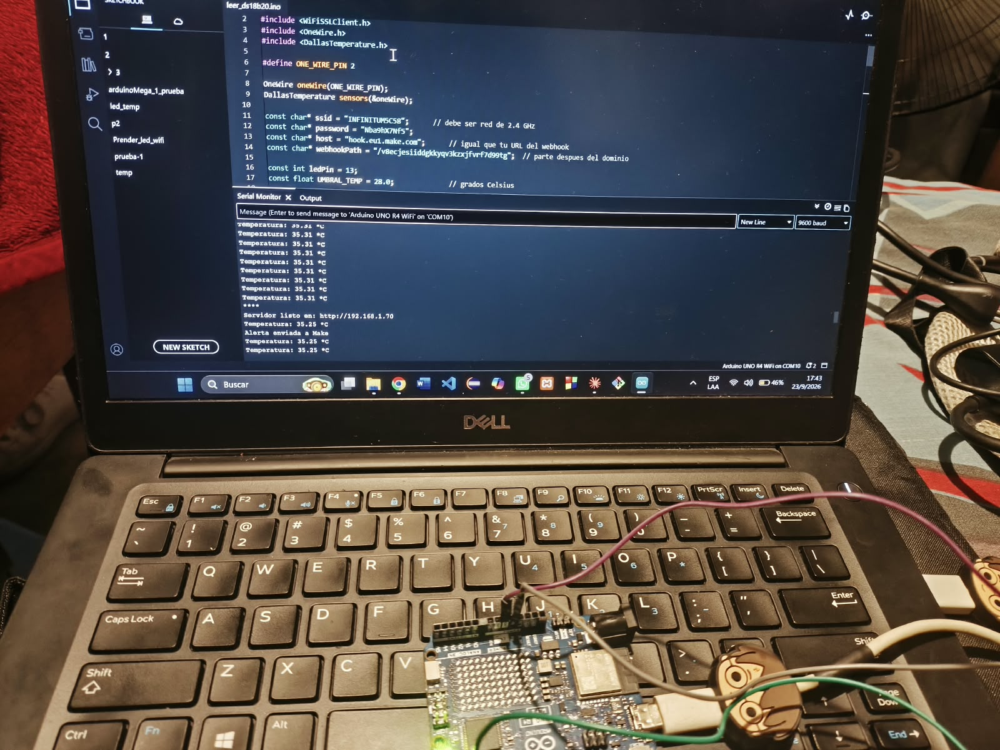
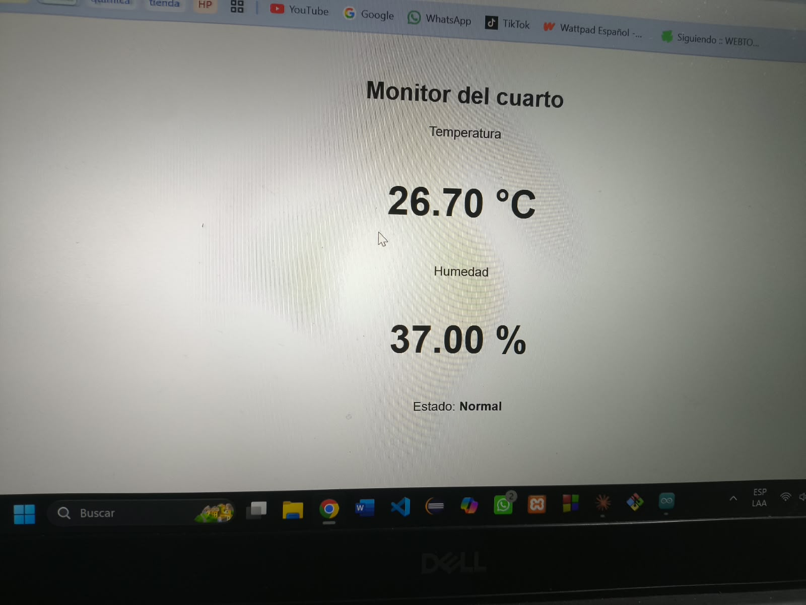
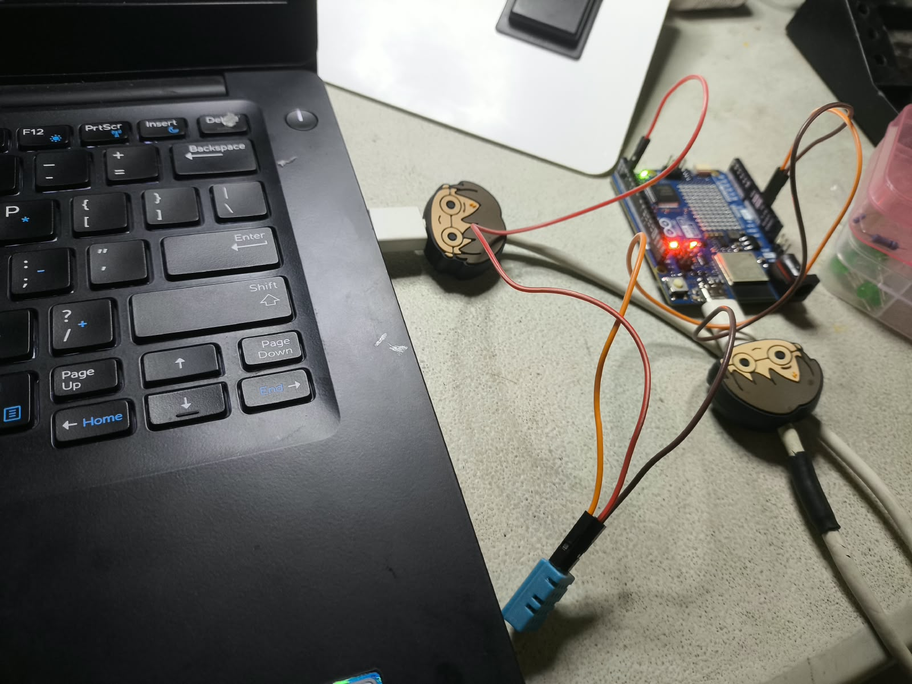
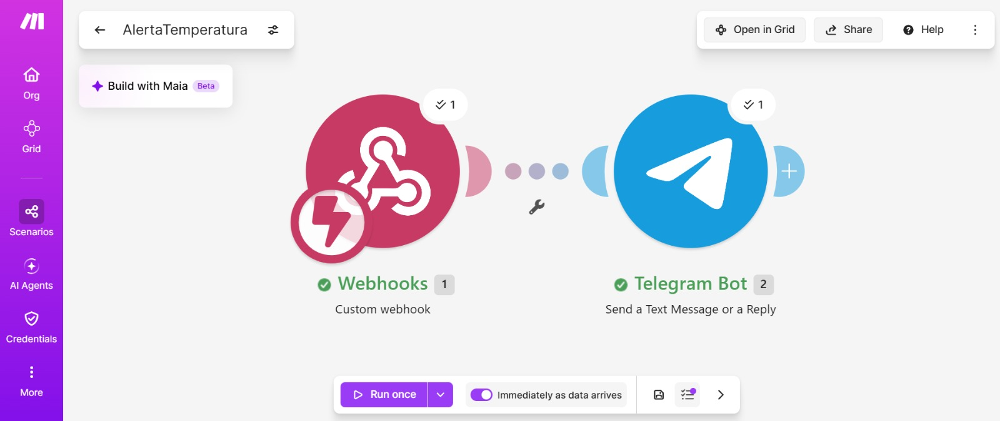
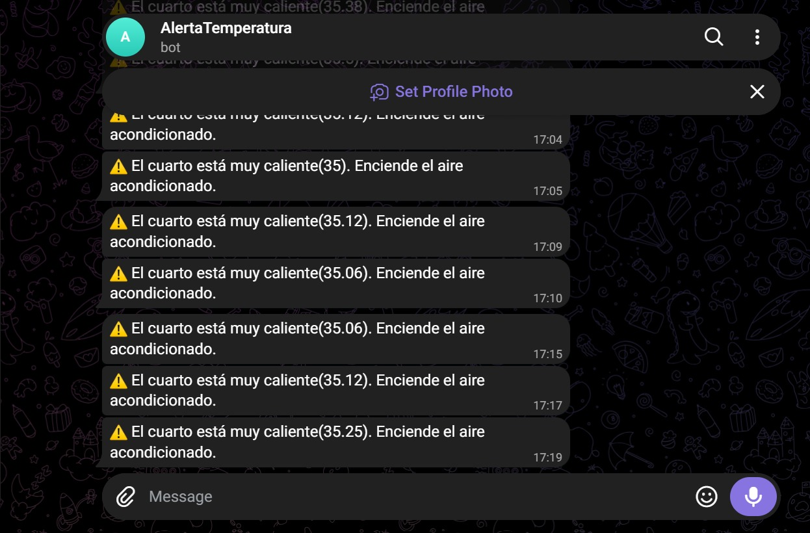

# Nombre del proyecto
Práctica "Arduino_Leer_DTH11_Make_Telegram"
## Descripción
En esta práctica se busca, mediante el uso de Make y Telegram, realizar un bot que identifique el ecosistema que existe alrededor de la universidad a partir de una fotografía y que nos dé información acerca de su nombre, su rol en la cadena alimenticia y su función.

## Objetivos de aprendizaje
Construir un sistema de alerta automática que detecte temperatura elevada con un sensor de temperatura y humedad, y notifique por Telegram mediante un escenario de Make.com, activado desde un Arduino UNO R4 WiFi.
## Material utilizado

Enumera todos los componentes usados:
1. Make
2. Telegram
3. Arduino IDE
4. Arduino R4 Wifi
5. Cables dupont
6. Sensor DHT11
7. Sensor 18B20
8. Resistencia 4.7 ohms
  
## Código
[Código Make](<Codigo/AlertaTemperatura.blueprint.json>)

[Código Arduino iDE](<Codigo/leer_DTH11.ino>)

## Imagenes
Foto Arduino IDE

Foto Demostracíon de Temperatura

Foto Arduino con sensor

Foto Make

Foto Telegram

## Resultados
Incluye:
[Resultado_Arduino_Leer_DTH11_Make_Telegram.pdf](Resultados/Resultado_Arduino_Leer_DTH11_Make_Telegram.pdf)

## Video del funcionamiento
[Readme](Video/Readme.txt)

[Ver video en YouTube](https://youtube.com/shorts/Eqr3F8Kncro)

## Conclusiones
El escenario "Leer DTH11" cumple el objetivo planteado: detecta temperatura elevada con el sensor, notifica automáticamente por Telegram a través de Make.com, y refleja el estado del sistema (temperatura, humedad y LED) en tiempo real desde la página propia del Arduino, sin enviar alertas repetidas mientras la condición se mantiene.
