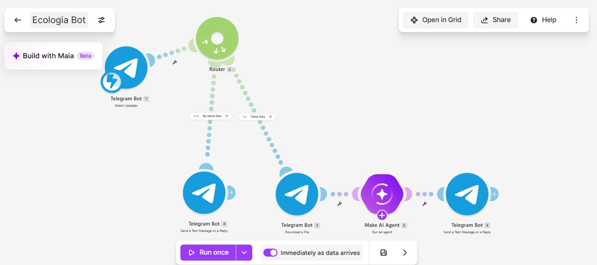
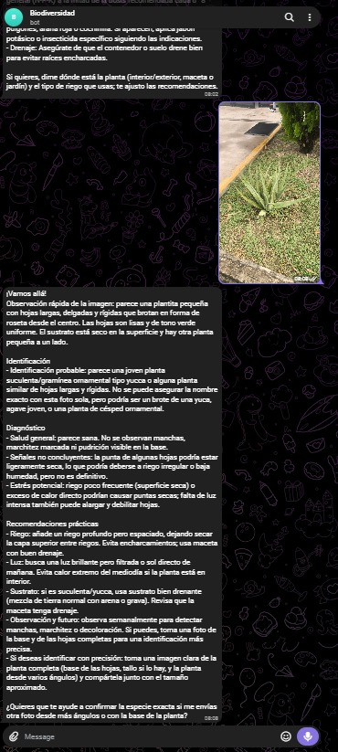

# Nombre del proyecto
Atomatización "Biodiversidad"
## Descripción
El escenario en Make se activa cuando llega una foto al bot de Telegram. La imagen se envía a un agente de inteligencia artificial con visión, que realiza tres tareas: identifica la especie, diagnostica el estado de la planta (plagas, enfermedades, exceso o falta de agua, falta de luz) y propone recomendaciones de riego, luz, poda o tratamiento. Finalmente, un módulo de Telegram devuelve la respuesta en el mismo chat.

## Objetivos de aprendizaje
Diseñar y probar una automatización en Make que, al recibir por Telegram la fotografía de una planta, la identifique, evalúe su estado de salud y entregue recomendaciones de cuidado, y medir qué tan acertados son sus resultados.

## Material utilizado
Enumera todos los componentes usados:
1. Make
2. Telegram
  
## Código
[Biodiversidad.blueprint.json](<Codigo/Biodiversidad.blueprint.json>)

## Imagenes
Foto del diagrama Make

Foto Bot Telegram

## Resultados
Incluye:
[Resultados](Resultados/Resultados_biodiversidad.pdf)

## Video del funcionamiento
[Readme](Video/Readme.txt)

[Ver video en YouTube](https://youtu.be/f2DGnhMxy2M)

## Conclusiones
La automatización cumplió su objetivo de identificar, diagnosticar y recomendar a partir de una foto. Los mejores resultados se dieron con fotos con buena luz y enfoque, mientras que los errores aparecieron cuando las fotos estuvieron desenfocadas o muy lejos. Es una herramienta útil como apoyo, aunque conviene confirmar el diagnóstico antes de aplicar tratamientos.
