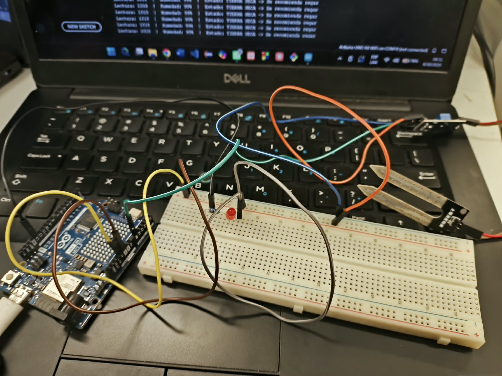
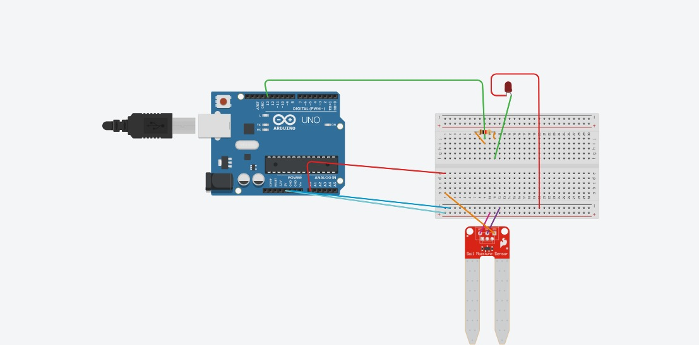

# Nombre del proyecto
Resultado de práctica "Monitor de humedad del suelo"

## Descripción
El sistema está formado por una placa Arduino UNO R4 WiFi, un sensor de humedad de suelo conectado a la entrada analógica A0 (alimentado con 5V y GND) y un LED conectado al pin 13 como alerta de riego. El programa lee el sensor cada segundo, convierte la lectura a un porcentaje de humedad entre 0 y 100 y la muestra en el Monitor Serie. Si el porcentaje es menor al umbral establecido (40%), imprime que la tierra está seca y se recomienda regar, y enciende el LED. Si es igual o mayor, indica que la tierra está húmeda y mantiene el LED apagado. (Aquí inserta la imagen del diagrama del circuito.)

## Objetivos de aprendizaje
Diseñar y probar un sistema con Arduino UNO R4 WiFi que, mediante un sensor de humedad, mida el nivel de humedad del suelo, lo convierta a porcentaje y active un LED de alerta cuando la tierra esté seca, para saber cuándo es necesario regar y apoyar el uso responsable del agua.

## Material utilizado
Enumera todos los componentes usados:
1. Arduino R4 Wifi
2. Cables Dupont
3. Protoboard
4. Led
5. Resistencia
6. Arduino IDE
7. Sensor de temperatura
  
## Código
[led_sensor.ino](<Codigo/led_sensor.ino>)

## Imagenes

## Resultados
Incluye:
[Resultado_Sensor.pdf](Resultados/Resultado_Sensor.pdf)

## Video del funcionamiento
[Readme](Video/Readme.txt)

[Ver video en YouTube]()

## Conclusiones
La práctica permitió diseñar una automatización en Make.com que conecta un bot de Telegram con un Agente de IA con visión, de modo que a partir de una sola fotografía se obtiene el nombre del organismo, su rol trófico y su función en el ecosistema del plantel. También se puso en práctica la configuración del bot con BotFather, la descarga de la imagen y el diseño del prompt que define el formato de la respuesta. En las pruebas, el bot identificó correctamente 3 de 11 fotografías (27.3 %), con un margen de error de 72.7 %. Las 2 imágenes de internet fueron identificadas bien, pero de las 9 fotografías tomadas directamente en el plantel solo 1 acertó, lo que sugiere que la calidad, el enfoque y el fondo de la imagen influyen de forma importante en el resultado. Por lo tanto, la herramienta resulta útil como apoyo didáctico para la materia de Desarrollo Sustentable, pero sus respuestas deben verificarse, y podría mejorarse con fotografías más nítidas y un prompt más específico.
