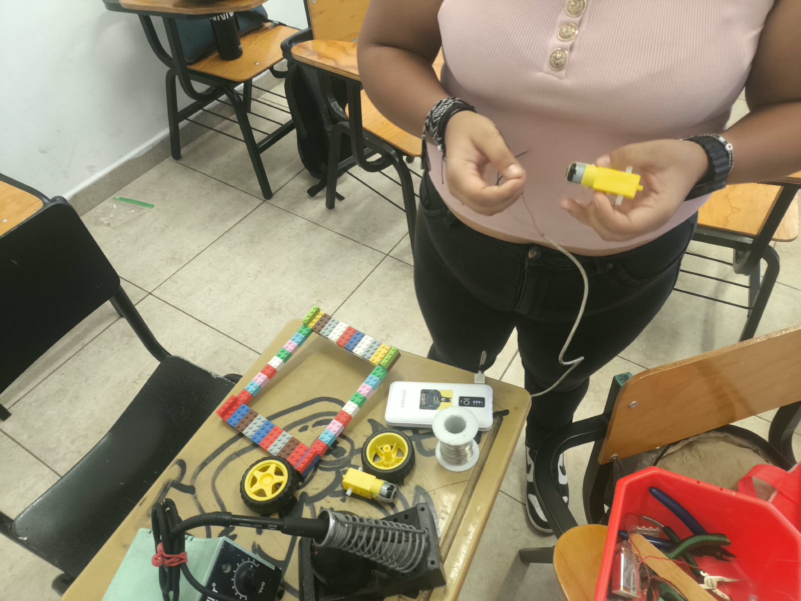
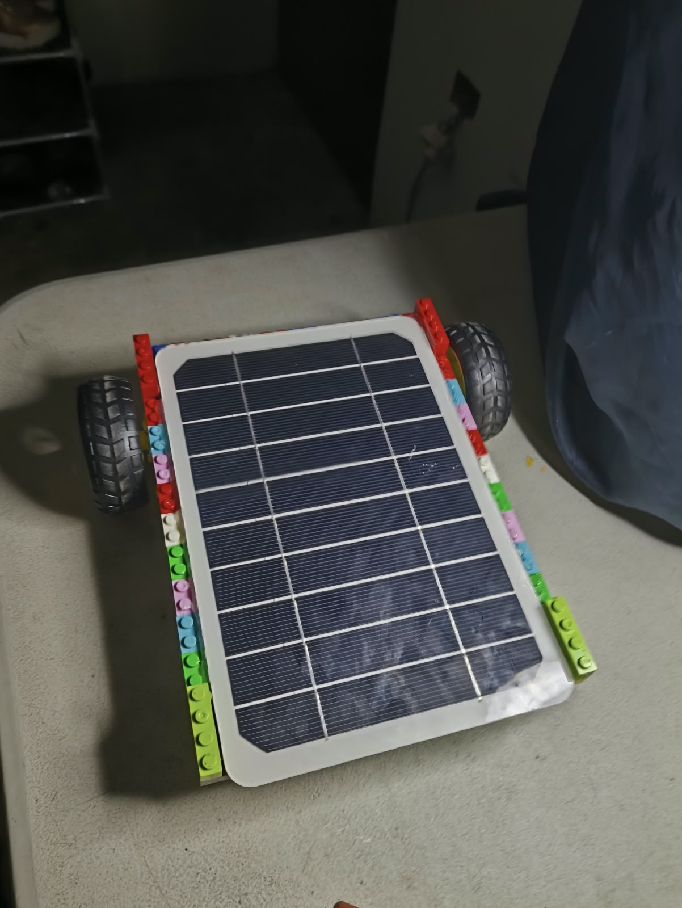
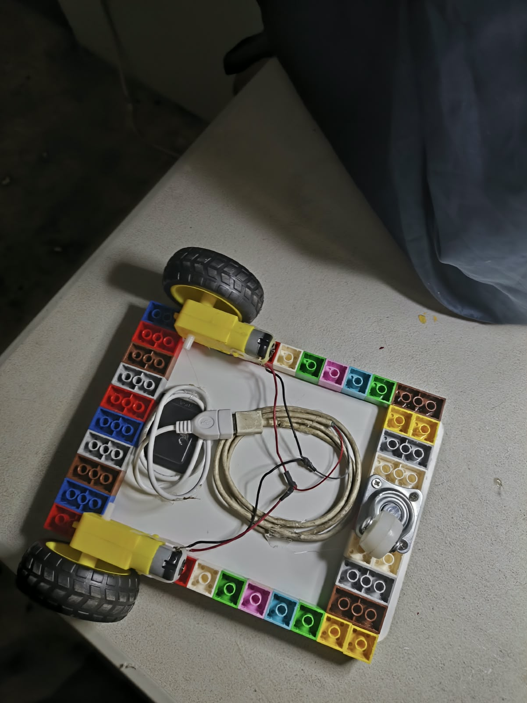
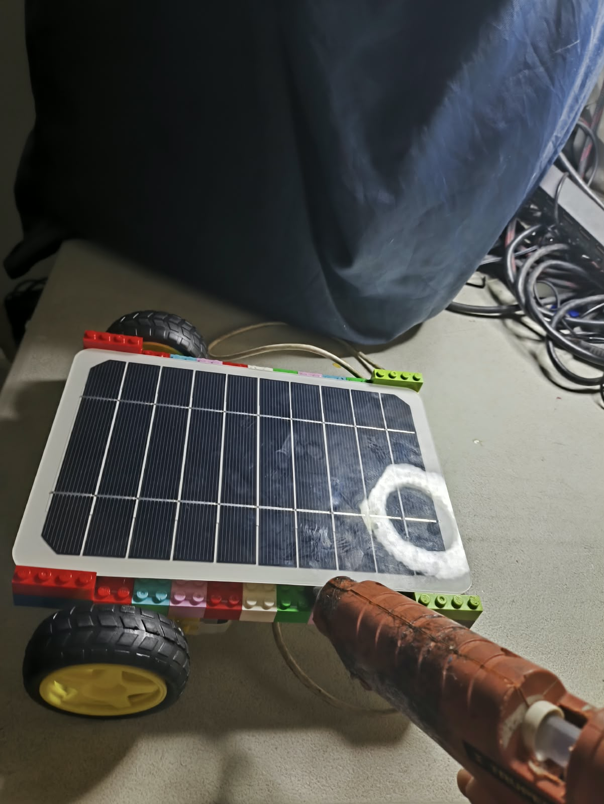
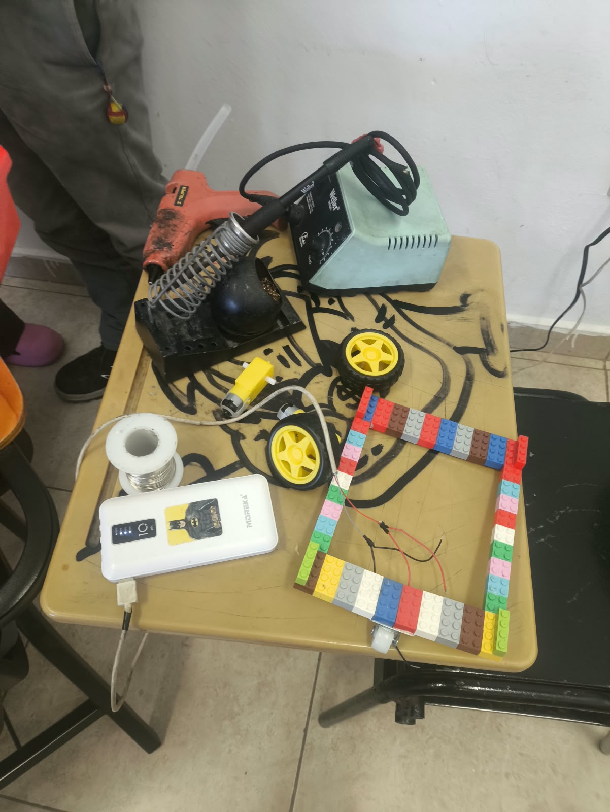
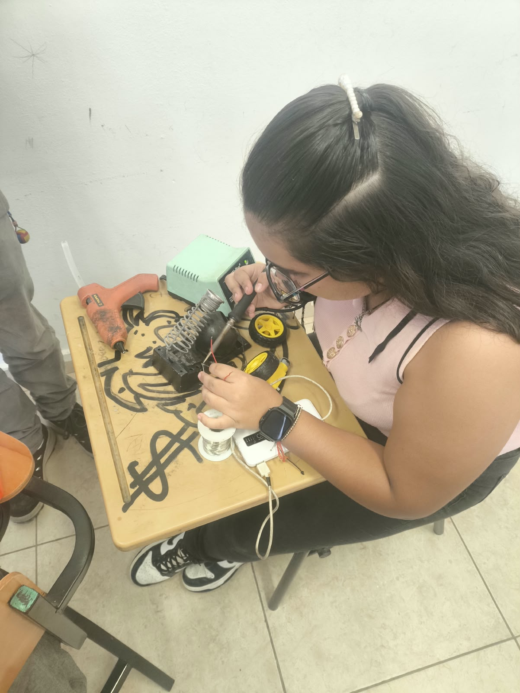

# Nombre del proyecto
Práctica “Carrito Solar” 
## Descripción
El carrito está compuesto por una estructura de piezas de Lego que funciona como chasis, sobre la cual se montó un panel solar de 5 volts. Este panel va conectado mediante cables a dos motorreductores, encargados de transmitir el movimiento a las llantas traseras. En la parte delantera se colocó una rueda loca, cuya función es guiar el desplazamiento del carrito y darle estabilidad durante el recorrido, ya que el sistema no cuenta con un mecanismo de dirección.

## Objetivos de aprendizaje
Construir un carrito autónomo capaz de desplazarse utilizando únicamente energía solar, integrando un panel fotovoltaico, motorreductores y una estructura mecánica funcional armada con piezas de Lego.

Enumera todos los componentes usados:
-Piezas de Lego (estructura)
-Panel solar de 5 volts
-Dos motorreductores con sus llantas
-Rueda loca
-Cables y cable hembra
-Soldadura y cautín
-Pistola de silicón y silicón
-Termofil
-Loctite
-Tornillos
-Mini drill
-Pinzas de corte

  
## Imagenes

## Resultados
Incluye:
[Resultado_CarritoSolar.pdf](Resultados/Resultado_CarritoSolar.pdf)

## Video del funcionamiento
[Readme](Video/Readme.txt)

[Ver video en YouTube](https://youtube.com/shorts/DVY0u2Kcm-E?feature=share)

## Conclusiones
El proyecto del carrito solar cumple el objetivo planteado: logra desplazarse de manera autónoma utilizando exclusivamente energía solar, gracias a la correcta conexión entre el panel fotovoltaico y los motorreductores, demostrando de forma práctica el aprovechamiento de energías renovables en un prototipo funcional.
