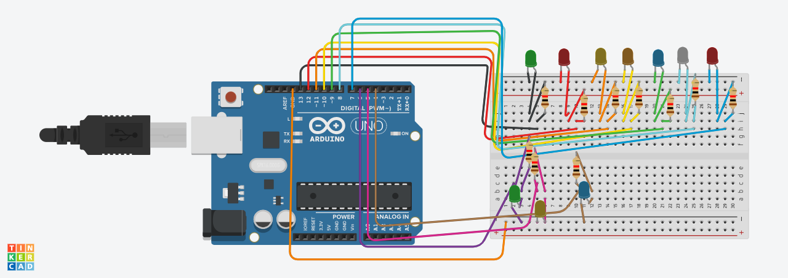
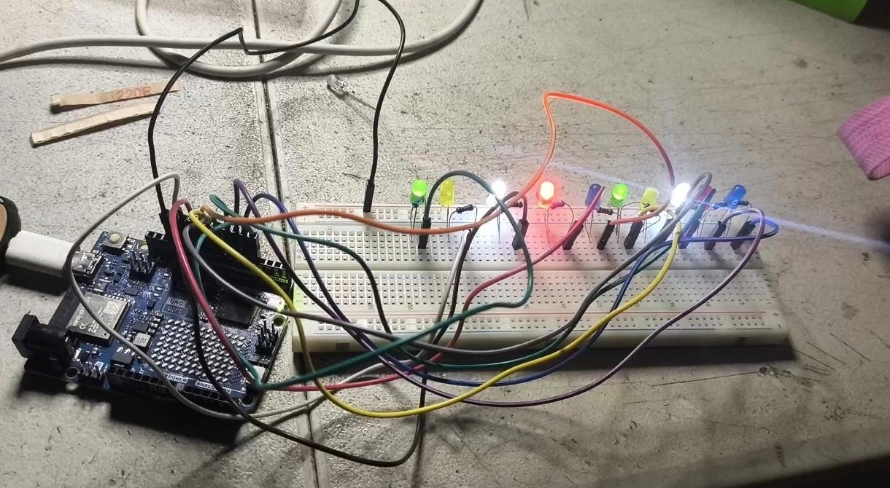

# Nombre del proyecto
Efectos de iluminación con 10 LEDs (Parpadeo independiente, Knight Rider y Cometa)

## Descripción
El objetivo de este codigo expone como prender y apagar un led, asi como realizar varias secuencias 

## Objetivos de aprendizaje
Programar y poner a prueba tres efectos de iluminación distintos sobre un arreglo de 10 LEDs, 
alternando entre ellos mediante un botón, aplicando lectura digital con antirrebote (debounce), 
control de tiempo no bloqueante con millis() y 
modulación de brillo mediante PWM por software.

## Material utilizado
Enumera todos los componentes usados:
- Arduino Uno R4 WiFi
- Protoboar
- Led(Distintos colores)
- Cables Dupont
- Resistencia 220 ohms
  

## Diagrama del circuito

## Código
[led13.ino](Codigo/10leds.ino)

## Video del funcionamiento

[Readme](Video/Readme.txt)

[Ver video en YouTube]([https://youtube.com/shorts/nkt2cob0rXs?si=nZyfMq3l9rj_INTb]([https://www.youtube.com/watch?v=r36q2z-AkHk&sttick=0](https://youtube.com/shorts/nkt2cob0rXs?si=nZyfMq3l9rj_INTb))

## Evidencias de armado

## Reporte
Incluye:
[Reporte_10LEDs.pdf](Reporte/Reporte_10LEDs.pdf)

- Gráficas (insertar imagen o link)
- Tablas de datos
- Observaciones sobre el comportamiento del sistema

## Conclusiones
La práctica permitió aplicar el manejo de múltiples salidas digitales de forma simultánea y no bloqueante mediante millis(), a diferencia del uso de delay() que detendría todo el programa. También se puso en práctica la lectura de un botón con antirrebote por software y la generación de PWM por software para controlar el brillo de los LEDs sin usar pines PWM dedicados. El resultado fueron tres efectos visuales claramente diferenciados, controlables en tiempo real con una sola entrada digital.

## Resultados
[Resultados _10leds.pdf](Resutados/Resultados _10leds.pdf)

Este documento contiene la descripción de la práctica, objetivos y procedimientos realizados.

- Reporte técnico estilo IEEE (PDF)
- Datos CSV (si aplica)
- Diagramas adicionales
