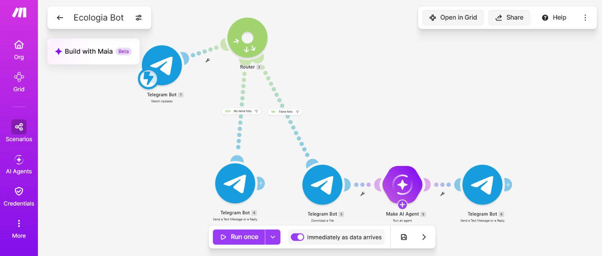
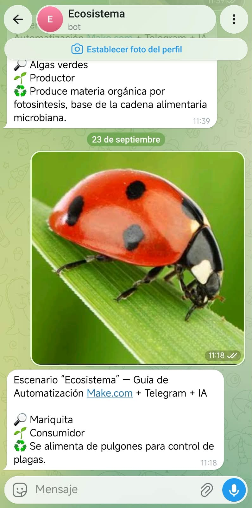

# Nombre del proyecto
Atomatización "Ecosistema"
## Descripción
En esta práctica se busca, mediante el uso de Make y Telegram, realizar un bot que identifique el ecosistema que existe alrededor de la universidad a partir de una fotografía y que nos dé información acerca de su nombre, su rol en la cadena alimenticia y su función.

## Objetivos de aprendizaje
Diseñar y documentar una automatización en Make.com que, mediante un bot de Telegram y un Agente de IA con
visión, identifique organismos del ecosistema del plantel educativo a partir de una fotografía y clasifique su rol trófico,
como herramienta de apoyo didáctico para la materia de Desarrollo Sustentable.

## Material utilizado
Enumera todos los componentes usados:
-Make
-Telegram
  
## Código
[led13.ino](Codigo/Ecologia Bot.blueprint.json)

## Imagenes

## Resultados
Incluye:
[Resultados_ecologia.pdf](Resultados/Resultados_ecologia.pdf)

## Video del funcionamiento
[Readme](Video/Readme.txt)

[Ver video en YouTube](https://youtu.be/tsgjGFkh2z4](https://youtu.be/tsgjGFkh2z4)

## Conclusiones
La práctica permitió diseñar una automatización en Make.com que conecta un bot de Telegram con un Agente de IA con visión, de modo que a partir de una sola fotografía se obtiene el nombre del organismo, su rol trófico y su función en el ecosistema del plantel. También se puso en práctica la configuración del bot con BotFather, la descarga de la imagen y el diseño del prompt que define el formato de la respuesta. En las pruebas, el bot identificó correctamente 3 de 11 fotografías (27.3 %), con un margen de error de 72.7 %. Las 2 imágenes de internet fueron identificadas bien, pero de las 9 fotografías tomadas directamente en el plantel solo 1 acertó, lo que sugiere que la calidad, el enfoque y el fondo de la imagen influyen de forma importante en el resultado. Por lo tanto, la herramienta resulta útil como apoyo didáctico para la materia de Desarrollo Sustentable, pero sus respuestas deben verificarse, y podría mejorarse con fotografías más nítidas y un prompt más específico.
